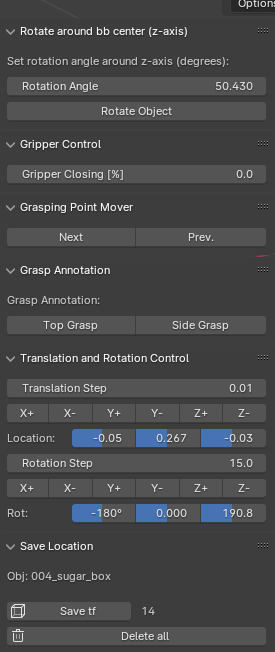

## grasp_annotation_blender
Script to manually annotate grasp points in blender for the HSR. You can change between what gripper and object to use via "obj_substring" and "use_hsr" respectively. Annotations will be saved in ./annotations. Load your model into ./models or change the path in the script. Running the script loads the model and the corresponding numpy file (if existing).

After running the script "LocationSave.py" in blender, the following panels are available in the region with category "TFs" on the right side (next to the scene collection):

#### Rotate around bb center (z-axis)

Rotates the gripper around the bounding box of the objects (z-axis).

- Rotation Angle: Angle the gripper should be rotated with
- Rotate Object: Rotates the gripper around the object with "Rotation Angle"

#### Gripper Control

Slider to open and close the gripper in percent (0-100).

#### Grasp Point Mover

Allows to set the gripper position using the already defined grasping points from the passed numpy file

#### Translation and Rotation Control

Translate and rotate the gripper around x, y and z (+X, -X, +Y, -Y, +Z, -Z). The values for the distance and angle are defined in Translation Step and Rotation Step

#### Save Location

Stores a numpy array of the flattened homogeneous tf matrix. The number of entries is displayed, as well as the objects name.
It's possible to delete all entries.

